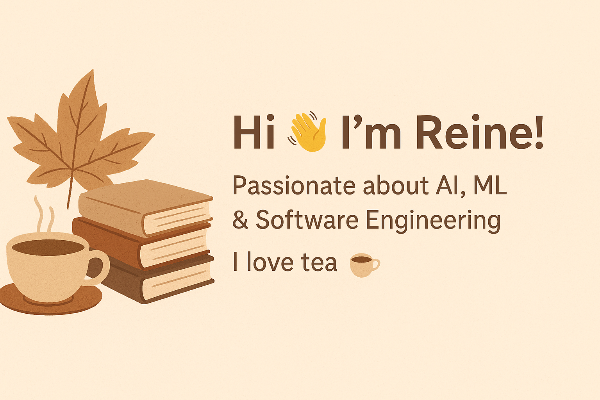

<!-- 🌸 Cozy GitHub Profile README -->

<!-- Banner -->

  

---

<h1 align="center"> 🍂 Hi, I’m <b>Reine</b> 🌸 </h1>  

  ✨ A curious soul exploring <b>AI, ML & Software Engineering</b> ✨  
   
  ☕ Tea lover | 📚 Bookworm | 🍁 Autumn aesthetic enthusiast  

---

## 🌷 Languages & Tools  

  <!-- Row 1 -->
  
  
  
  

  <!-- Row 2 -->
  
  
  
  
  
  

---

## 🌸 About Me  

- 🎓 3rd-year **B.E. Student** @ RVCE  
- 💡 Passionate about **AI, ML, Web Dev & Creative Engineering**  
- 📚 **Joint Director – Literary Services**, Rotaract Club of RVCE  
- ✨ Dreamer 🌙 | Builder 🚀 | Lifelong Learner 🌱  

---

## 💌 Let’s Connect  

  
  

---

  
🌼 _Thanks for visiting my cozy corner on GitHub!_ 🌼  

