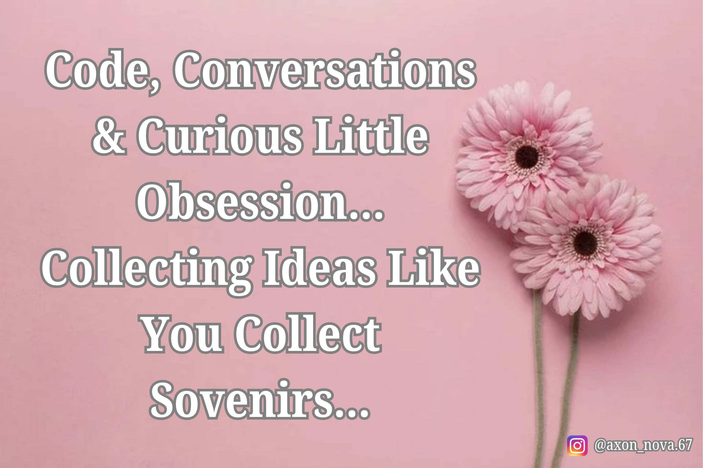

 

<table>
<tr>
<td align="center">

</td>
</tr>
</table>

 

&nbsp;

&nbsp;

  

# 𓂃 REINE

### `AI / ML` · `Software Engineering` · `Research` · `Creative Technology`

 

&nbsp;

&nbsp;

&nbsp;

  

🎀 &nbsp; `code` · `conversations` · `curiosity` · `little obsessions` &nbsp; 🎀

 

---

 

## 🎀 A Little About Me 🎀

 

Hi, I'm **Priyam**.

I'm an **Engineering undergraduate at RV College of Engineering, Bengaluru**, exploring the intersection of **artificial intelligence, machine learning, software engineering, research, biotechnology, and creativity**.

I like taking a tiny question seriously.

A *"what if?"* becomes an experiment.  
An experiment becomes a "prototype"*.  
A prototype becomes a system.  
And sometimes, that system becomes something I become ridiculously attached to.

I like technology with a little personality.

And ideas with somewhere to go.

 

&nbsp;

&nbsp;

&nbsp;

&nbsp;

 

---

## 𓂃 things that make my brain light up

 

<table>
<tr>

<td align="center" width="25%">

 

**ARTIFICIAL**  
**INTELLIGENCE**

</td>

<td align="center" width="25%">

 

**MACHINE**  
**LEARNING**

</td>

<td align="center" width="25%">

🧬

 

**BIOTECHNOLOGY**  
**& OMICS**

</td>

<td align="center" width="25%">

 

**SOFTWARE**  
**ENGINEERING**

</td>

</tr>
</table>

 

`research` · `data` · `experimentation` · `creative technology`

 

---

# 🎀 selected work

### six projects · six rabbit holes · countless tabs open

 

the things currently living in my little corner of GitHub

 

<table>
<tr>

<td width="50%" valign="top">

🎀

### Bio-Tech-Quiz-Quest

A full-stack educational **RPG game built around biotechnology learning**.

Students explore a top-down pixel-art biotech campus and engage with academic content through an interactive game experience.

 

  

</td>

<td width="50%" valign="top">

☁️

### Cloud-Based-Storage-Device

**CloudVault** — a Google Drive-style file storage API built using **Java 17 and Spring Boot**.

A backend exploration of cloud storage, APIs, architecture, and file management.

 

  

</td>

</tr>

<tr>

<td width="50%" valign="top">

🌷

### crowd-management

**CrowdGuard AI** — a multimodal crowd-safety intelligence system combining **computer vision, audio analysis, risk fusion, and real-time monitoring**.

Built around multiple signals to identify potential crowd violence and panic.

 

  

</td>

<td width="50%" valign="top">

📊

### Instagram Performance Analytics

An interactive performance analysis of **Sugar Cosmetics' Instagram presence**, examining engagement, impressions, posting behaviour, and content effectiveness.

 

  

</td>

</tr>

<tr>

<td width="50%" valign="top">

🎀

### NavAura

An **AI-powered maternal and infant nutrition companion** designed to recognise food, understand nutritional value, and turn that information into personalized, evidence-grounded guidance.

 

  

</td>

<td width="50%" valign="top">

🧫

### OMICS-CANCER

**GeneScope AI** — an interactive transcriptomic biomarker discovery platform for comparative cancer gene-expression analysis.

Exploring differential expression, pathway analysis, PCA, clustered heatmaps, and transcriptomic patterns.

 

  

</td>

</tr>
</table>

 

🎀 ─────────────────────── 🎀

 

**six projects · six questions · one persistent curiosity**

 

---

## 🧬 Biology × Data × Intelligence × Engineering

 

<table>
<tr>

<td align="center" width="25%">

🧬

### BIOLOGY

biotechnology  
omics  
biological systems

</td>

<td align="center" width="25%">

🔎

### DATA

patterns  
analysis  
evidence

</td>

<td align="center" width="25%">

🎀

### INTELLIGENCE

AI  
machine learning  
models

</td>

<td align="center" width="25%">

💻

### ENGINEERING

software  
systems  
experiences

</td>

</tr>
</table>

 

**This little intersection is where I like to build.**

 

---

## 🎀 My Little Toolkit

  

  

 

---

## 🧪 academia

 

### RV College of Engineering · Bengaluru

**B.E. Biotechnology**

`2023 — 2027`

 

🎀

### biology → data → intelligence → engineering

 

---

## 🌷 the softer side

 

Not everything needs to become a project.

Sometimes I read.

Sometimes I write.

Sometimes I collect tiny observations that probably don't need collecting.

I like beautiful interfaces, thoughtful conversations, playlists that become entire personalities, autumn weather, literature, quiet cafés, interesting rabbit holes, and the particular satisfaction of making something work at **2:17 AM**.

I'm also part of **Rotaract Club of RVCE**, serving as **Joint Director – Literary Services**.

Because words are another kind of technology.

They move ideas from one person to another.

 

🎀 &nbsp; **Code is One Language · Words Are Another** &nbsp; 🎀

 

---

## 𓂃 The Way I Like To Build

 

&nbsp; →
&nbsp;

&nbsp; →
&nbsp;

&nbsp; →
&nbsp;

&nbsp; →
&nbsp;

&nbsp; →
&nbsp;

  

**curiosity → questions → experiments → building → refining → something worth keeping**

 

---

## 🎀 Find Me Around The Internet

 

  

🎀 &nbsp; `code` · `conversations` · `curiosity` · `little obsessions` &nbsp; 🎀

 

---

# 𓂃

### **build curious things.**
### **ask better questions.**
### **leave room for wonder.**

 

&nbsp;&nbsp;
**— REINE**
&nbsp;&nbsp;

  

made with curiosity, too many tabs, and a little bit of ✨

